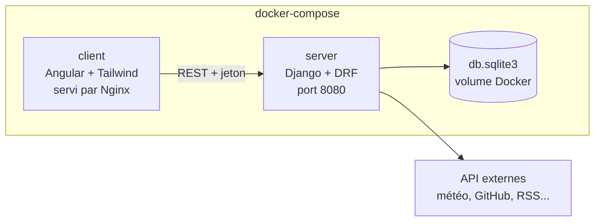
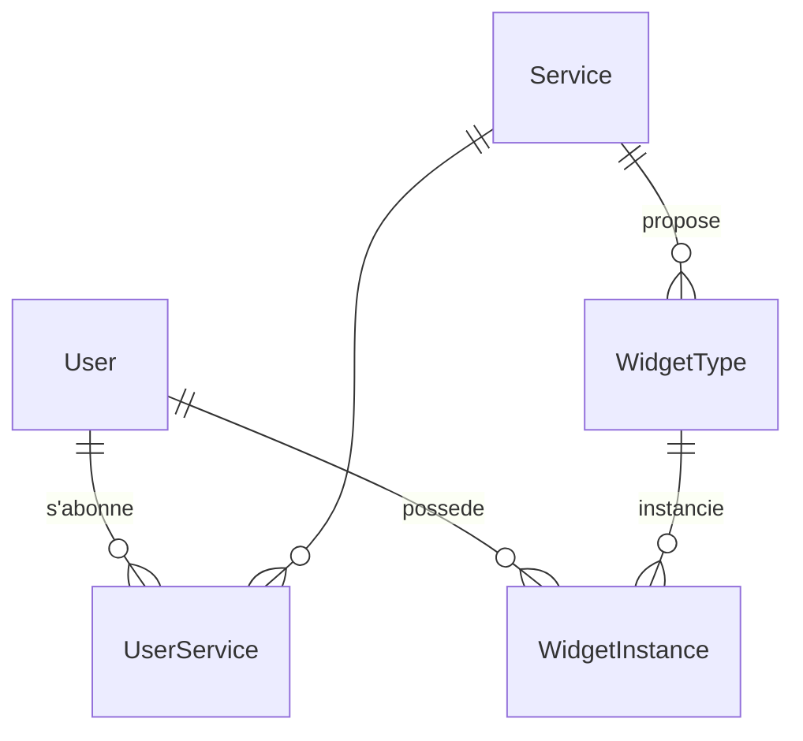

# Dashboard

Application web permettant à chaque utilisateur de construire son propre tableau de bord à partir de widgets connectés à des services externes (météo, GitHub, RSS, etc.). Les widgets sont configurables, se rafraîchissent automatiquement et peuvent être ajoutés, déplacés, reconfigurés ou supprimés.

Interface en thème sombre aux couleurs de Discord.

## Sommaire

- [Fonctionnalités](#fonctionnalités)
- [Services et widgets](#services-et-widgets)
- [Installation et lancement](#installation-et-lancement)
- [Utilisation](#utilisation)

## Fonctionnalités

- Inscription avec confirmation, connexion par identifiants et par OAuth 2.0 (compte tiers lié à un utilisateur existant)
- Section d'administration des utilisateurs (Django admin)
- Abonnement aux services, certains disponibles par défaut (météo), d'autres après connexion du compte
- Dashboard personnel : ajouter, reconfigurer, déplacer et supprimer des instances de widgets
- Plusieurs instances d'un même widget avec des configurations différentes
- Rafraîchissement automatique de chaque widget selon son propre intervalle
- Interface responsive et accessible
- Route `GET /about.json` décrivant les services et widgets disponibles

## Services et widgets

| Service | Widget | Paramètres | Authentification |
| --- | --- | --- | --- |
| weather | city_temperature | `city` (string) | Aucune |
| _à compléter_ | | | |

Pour un groupe de X étudiants, le sujet impose au moins 1 + X services et 3 × X widgets. Chaque widget doit avoir au moins un paramètre configurable.

## Installation et lancement

### Prérequis

- Docker
- Docker Compose

### Configuration

Copier le fichier d'exemple et renseigner les clés d'API :

```bash
cp .env.example .env
```

Le fichier `.env` n'est jamais versionné : aucune clé ni mot de passe ne doit apparaître dans le dépôt.

### Build et lancement

```bash
docker-compose build
docker-compose up
```

La base SQLite est stockée dans un volume Docker : les données sont conservées entre deux redémarrages et deux rebuilds.

| Service | Adresse |
| --- | --- |
| Client (Angular) | http://localhost:8081 |
| Serveur (API Django) | http://localhost:8080 |
| Administration | http://localhost:8080/admin |
| about.json | http://localhost:8080/about.json |

Créer un compte administrateur :

```bash
docker-compose exec server python manage.py createsuperuser
```

## Utilisation

1. Créer un compte puis confirmer l'inscription.
2. Se connecter.
3. Depuis le profil, s'abonner aux services voulus (connexion OAuth si nécessaire).
4. Sur le dashboard, cliquer sur **Ajouter un widget** : choisir le type, le configurer, régler l'intervalle de rafraîchissement, valider.
5. Glisser-déposer un widget pour le déplacer, utiliser son menu pour le reconfigurer ou le supprimer.

## Architecture



Le navigateur ne contacte que l'API Django. Django seul lit la base et appelle les API externes, ce qui garde les clés et jetons OAuth côté serveur. Chaque widget Angular relance sa requête selon son propre intervalle (timer RxJS).

## Choix technologiques

| Couche | Choix |
| --- | --- |
| Frontend | Angular + Tailwind (Bootstrap limité à la grille et aux modales) |
| Backend | Django + Django REST Framework, django-allauth |
| Base de données | SQLite |

### Critères de comparaison

Chaque option est évaluée sur les mêmes critères, résumés en points positifs et négatifs.

| Critère | Ce qu'on mesure |
| --- | --- |
| Adéquation au besoin | Couverture native des fonctionnalités du projet |
| Compétences du groupe | Ce que l'équipe maîtrise déjà, coût de montée en compétence |
| Écosystème | Bibliothèques disponibles, documentation, communauté |
| Sécurité | Protections fournies par défaut, gestion des secrets et de l'authentification |
| Maintenabilité | Structure imposée, typage, lisibilité pour un projet à plusieurs |
| Intégration Docker | Simplicité de conteneurisation et de déploiement |

### Frontend : framework

| Option | Points positifs | Points négatifs |
| --- | --- | --- |
| **Angular** (retenu) | Routing, formulaires réactifs, client HTTP, guards et intercepteurs inclus<br>Déjà pratiqué par le groupe<br>Angular CDK (glisser-déposer, accessibilité) et RxJS<br>Échappement XSS par défaut, support CSRF dans HttpClient<br>TypeScript natif, architecture imposée | Courbe d'apprentissage plus raide que React ou Vue<br>Plus verbeux (modules, services, décorateurs)<br>Bundle initial plus lourd |
| **React** | Écosystème le plus vaste<br>Grande communauté, beaucoup de ressources<br>Bibliothèque légère et flexible | Routing, formulaires et gestion d'état à choisir à part<br>Liberté totale : conventions à fixer en équipe<br>Seulement des notions partielles dans le groupe |
| **Vue** | Prise en main rapide<br>Routing et store officiels<br>Structure claire des composants | Écosystème plus restreint<br>TypeScript optionnel, moins strict<br>Peu ou pas pratiqué par le groupe |

**Conclusion :** Angular couvre nativement ce que le dashboard demande. Le CDK fournit le glisser-déposer pour déplacer les widgets et des outils d'accessibilité exigés par le sujet. Les intercepteurs HTTP centralisent l'ajout du jeton d'authentification, et RxJS (`interval`, `switchMap`) se prête bien au timer de rafraîchissement par widget. Le groupe le connaît déjà, ce qui évite une phase d'apprentissage.

### Frontend : style

| Option | Points positifs | Points négatifs |
| --- | --- | --- |
| **Tailwind CSS** (retenu) | Thème sur mesure (couleurs Discord) via variables CSS<br>Styles au plus près du template, pas de CSS mort<br>Compilé au build Angular | Templates chargés de classes<br>Aucun composant prêt (modales, menus à construire) |
| **Bootstrap** | Composants prêts à l'emploi (grille, modales)<br>Très connu, documentation abondante | Look Bootstrap difficile à effacer<br>Surcharges nécessaires pour un thème personnalisé<br>Conflit possible avec le preflight de Tailwind |
| **Angular Material** | Composants complets et accessibles<br>API cohérente, maintenue par l'équipe Angular | Look Material éloigné de Discord<br>Personnalisation du thème complexe<br>Peu pratiqué par le groupe |

**Conclusion :** Tailwind sert de base de style, avec les couleurs Discord définies en variables CSS dans `styles.css`. Bootstrap est limité à ce qu'il apporte en plus (grille responsive, modales) et importé sans son reboot, pour ne pas entrer en conflit avec le preflight de Tailwind.

Palette utilisée :

| Rôle | Couleur |
| --- | --- |
| Fond principal | `#313338` |
| Cartes, panneaux | `#2b2d31` |
| Champs de saisie | `#1e1f22` |
| Accent (boutons, focus) | `#5865f2` |
| Danger | `#da373c` |
| Succès | `#23a55a` |
| Texte | `#f2f3f5` |
| Texte secondaire | `#b5bac1` |
| Liens | `#00a8fc` |

### Backend

| Option | Points positifs | Points négatifs |
| --- | --- | --- |
| **Django + DRF** (retenu) | Authentification, sessions, admin, ORM et migrations inclus<br>OAuth 2.0 via django-allauth<br>Python pratiqué par le groupe<br>Bibliothèques Python pour chaque API (requests, feedparser, clients GitHub)<br>Protections CSRF, XSS, injection SQL et hachage des mots de passe par défaut | Pas de typage strict (Python dynamique)<br>Deux langages dans le projet (Python et TypeScript)<br>Structure imposée parfois rigide |
| **NestJS** (Node.js) | TypeScript partagé avec Angular<br>Architecture modulaire proche d'Angular<br>Écosystème npm très vaste | Authentification et ORM à assembler (Passport, TypeORM ou Prisma)<br>Pas d'interface d'administration fournie<br>Framework nouveau pour le groupe |
| **Spring Boot** (Java) | Spring Security et OAuth2 très complets<br>Robuste, typé, orienté entreprise | Configuration lourde et code verbeux<br>Image Docker JVM plus lourde, démarrage plus lent<br>Java peu pratiqué par le groupe |

**Conclusion :** Django répond directement à trois exigences du sujet sans code supplémentaire : l'inscription et l'authentification, le hachage des mots de passe, et la section d'administration (Django admin). django-allauth gère l'OAuth 2.0 et le rattachement d'un compte tiers à un utilisateur existant. DRF expose l'API REST consommée par Angular et la route `/about.json` sur le port 8080. L'écosystème Python simplifie les appels aux API externes, et le groupe connaît déjà le langage. NestJS reste une alternative sérieuse mais demande d'assembler soi-même ce que Django fournit.

### Base de données

| Option | Points positifs | Points négatifs |
| --- | --- | --- |
| **SQLite** (retenu) | Base par défaut de Django, zéro configuration<br>Aucun conteneur supplémentaire, un volume suffit<br>Aucun port réseau exposé<br>Relationnel, transactions ACID, JSONField supporté | Une seule écriture à la fois<br>Pas de gestion fine des rôles et des accès<br>Peu adapté à un grand nombre d'utilisateurs simultanés |
| **PostgreSQL** | Écritures concurrentes, très performant<br>JSONB indexé pour les paramètres de widgets<br>Rôles fins, contraintes d'intégrité avancées | Serveur à configurer et administrer<br>Conteneur dédié, attente du démarrage de la base à gérer<br>Surdimensionné pour la charge du projet |
| **MongoDB** | Schéma souple pour les configurations de widgets<br>Stockage natif en documents JSON | Pas supporté par l'ORM Django, bibliothèque tierce nécessaire<br>Relations utilisateur / service / widget peu naturelles<br>Intégrité à garantir côté application<br>Peu pratiqué par le groupe |

**Conclusion :** le modèle est naturellement relationnel : un utilisateur a des abonnements à des services, et des instances de widgets placées sur son dashboard. SQLite garantit ces liens par des clés étrangères, et le JSONField de Django stocke les paramètres différents d'un widget à l'autre sans multiplier les tables. C'est la base par défaut de Django : aucun serveur à installer, aucun conteneur supplémentaire, ce qui simplifie le docker-compose et le développement local. Le fichier de base est placé sur un volume Docker pour que les données survivent aux redémarrages. Les jetons OAuth des services sont chiffrés avant stockage.

**Limites assumées :** SQLite n'accepte qu'une écriture à la fois, ce qui suffit pour la charge d'un projet étudiant mais pas pour un grand nombre d'utilisateurs simultanés. Si le besoin évolue, la migration vers PostgreSQL ne demande que de changer `DATABASES` dans `settings.py` et d'ajouter un service `db` au docker-compose : les modèles Django restent identiques.

## Modèle de données



| Table | Champs clés |
| --- | --- |
| User | email, mot de passe haché, is_active (confirmation), is_staff (admin) |
| Service | nom, requires_auth |
| UserService | user, service, jetons chiffrés, date d'expiration |
| WidgetType | service, nom, description, schéma des paramètres |
| WidgetInstance | user, widget_type, params (JSON), refresh_interval (s), position |

## POC

Un seul POC, réalisé avec la stack retenue avant le développement, valide que les trois couches communiquent de bout en bout dans docker-compose.

### Périmètre

1. `docker-compose up` lance deux conteneurs : client (Angular servi par Nginx) et server (Django sur le port 8080, base SQLite sur un volume).
2. `GET http://localhost:8080/about.json` renvoie l'IP du client, l'heure serveur en timestamp Unix et la liste des services et widgets lue en base.
3. Inscription et connexion par identifiants, avec jeton d'authentification transmis par un intercepteur Angular.
4. Un widget configurable de bout en bout : météo d'une ville (paramètre `city`, type string), appel à l'API météo côté Django.
5. Deux instances de ce widget sur le dashboard avec deux villes et deux intervalles de rafraîchissement différents.
6. Interface en thème sombre aux couleurs de Discord via Tailwind.

### Critères de validation

- [ ] `docker-compose build` puis `up` fonctionnent sur une machine vierge
- [ ] `/about.json` respecte le format du sujet
- [ ] Un utilisateur peut s'inscrire, se connecter et voir son dashboard
- [ ] Les deux instances affichent des données distinctes et se rafraîchissent chacune à leur rythme
- [ ] Aucun secret (clé d'API, mot de passe) n'est présent dans le dépôt : tout passe par un fichier `.env` ignoré par git

**Hors périmètre du POC :** OAuth, confirmation par email, déplacement des widgets et administration, traités pendant le développement.

## Structure du dépôt

```
.
├── docker-compose.yml
├── .env.example
├── README.md
├── client/          # Application Angular
│   ├── Dockerfile
│   └── src/
├── server/          # API Django
│   ├── Dockerfile
│   ├── manage.py
│   └── ...
└── bonus/           # Fichiers bonus éventuels
```